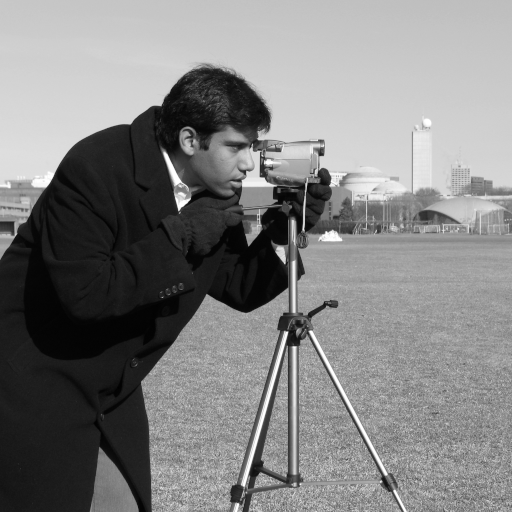
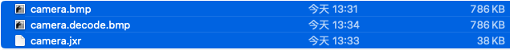
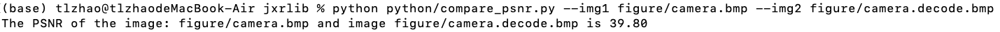
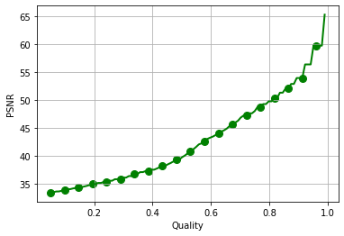
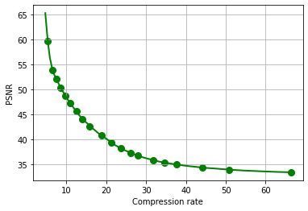

开始使用
=========

编译
----------

libjxr的编译比较简单，直接在终端键入::

    make

即可开始编译,编译完成后生成的所有文件均放置在build目录下。

压缩一张图片
---------------------

在figure目录下找到图片 camera.bmp:

然后键入下面的命令可以进行图片压缩:

.. code-block:: bash
   :linenos:

   build/JxrEncApp -i figure/camera.bmp -o figure/camera.jxr -q 0.5 -c 0

在上面的命令中， `build/JxrEncApp` 是编译完成后生成的可执行文件，用来进行图像压缩。该命令接受多个输入参数，这里只介绍用到的三个参数：

* `-i` : 未压缩的输入图片路径。
* `-o` : 压缩后的图片保存路径。
* `-q` : 质量参数，在0-1之间，代表压缩程度。此参数越大，图片压缩越多，同时损失越多；参数越小，图片压缩越少，同时损失越少。
* `-c` : 输入图片格式，0代8bit BGR格式。

压缩完成后，会在 `figure` 目录下生成一个 `camera.jxr` 的文件:

可以看到，压缩前的 `camera.bmp` 图片大小为786KB，而压缩后的 `camera.jxr` 文件大小仅为38KB，压缩了20倍左右。

压缩后解码
------------------

经过上面的操作，我们将原始图片压缩了20倍之多，那么信息损失如何呢？我们来对压缩后的文件进行重新解码，恢复出原始图片::
    
    build/JxrDecApp -i figure/camera.jxr -o figure/camera.decode.bmp -c 0

执行上述命令将压缩后的 `camera.jxr` 文件进行重新解码，恢复出原始图片:

.. image:: ../../figure/camera.decode.bmp
   :width: 45%
   :align: right

.. note::
   上面的图片中，左边是原始图片，右边是压缩之后恢复的图片。

计算一下原始图片与压缩后恢复的图片之间的PSNR::

    python python/compare_psnr.py --img1 figure/camera.bmp --img2 figure/camera.decode.bmp

运行之后得到下面的运行结果:

压缩比-PSNR曲线
------------------------

请参考 `rate-distortion notebook`_

.. _rate-distortion notebook: ../../python/rate-distortion.ipynb

下面是运行结果:

.. note::
    上图中，左侧是quality与PSNR之间的关系曲线；右侧是压缩比与PSNR之间的关系曲线。
